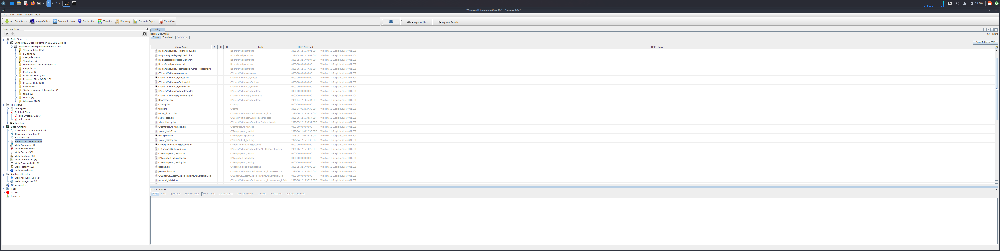
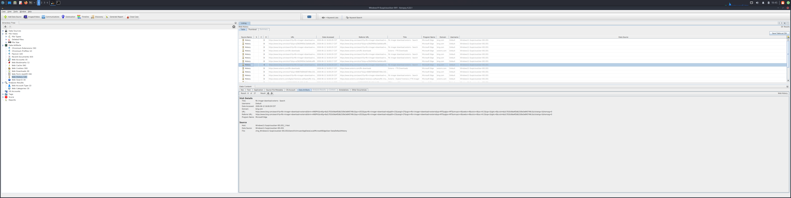
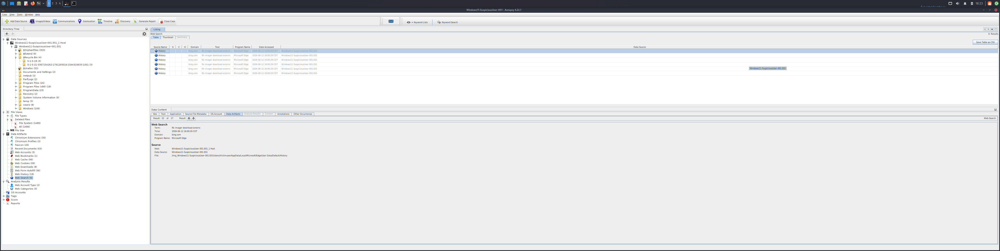
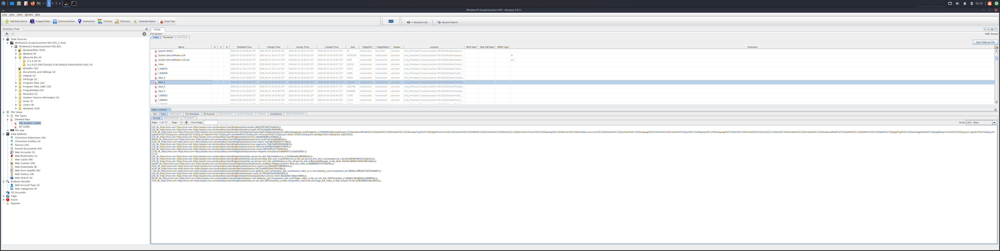
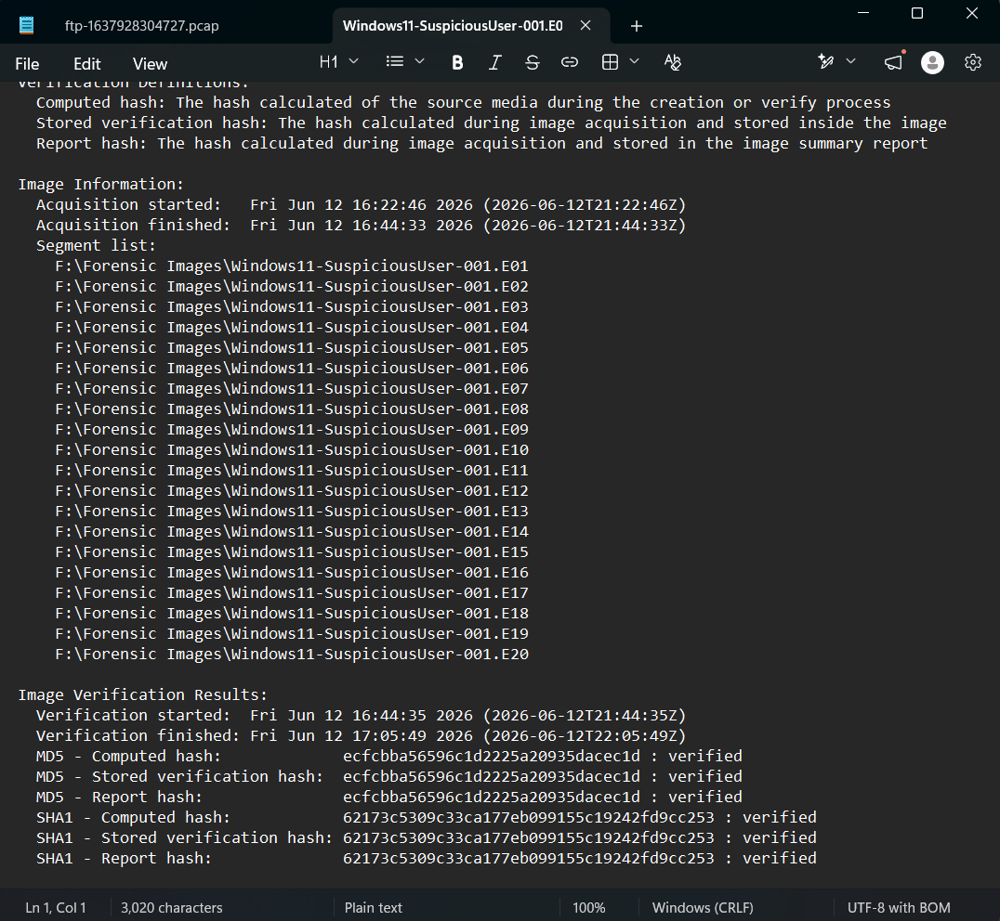

# Case 001 — Windows 11 Suspicious User Investigation

## Overview

This case involves a forensic investigation of a Windows 11 disk image flagged for suspicious
user activity. The objective was to identify evidence of unauthorized access, data access, and
user behavior using industry-standard digital forensics tools and methodology.

All analysis was performed on Kali Linux using Autopsy 4.22.1.

---

## Case Details

| Field | Details |
|-------|---------|
| Case Name | Windows11-SuspiciousUser-001 |
| Image File | Windows11-SuspiciousUser-001.E01 |
| Image Format | Expert Witness Format (E01) |
| Operating System | Windows 11 |
| Investigator | Eric Sterman |
| Platform | Kali Linux |
| Tool | Autopsy 4.22.1 |

---

## Lab Environment

| Component | Details |
|-----------|---------|
| Host Machine | MSI Aegis R2 (Intel Core Ultra 9 285, 64GB DDR5) |
| Analysis Platform | Kali Linux (VMware Workstation) |
| Primary Tool | Autopsy 4.22.1 |
| Evidence Storage | External SSD — Eric's Cyber Network SSD (3.7TB) |

---

## Objective

Conduct a forensic examination of a Windows 11 disk image to identify:

- Evidence of suspicious user activity
- Recently accessed files and documents
- Web browsing history and search activity
- Deleted files and artifacts
- Timeline of user actions

---

## Methodology

### 1. Evidence Verification

Hash verification was performed on the E01 image prior to analysis to confirm integrity
and establish a forensic baseline.

### 2. Image Ingestion

The E01 image was loaded into Autopsy 4.22.1 and processed with the following ingest modules:

- Recent Activity
- Hash Lookup
- File Type Identification
- Keyword Search
- Email Parser

### 3. Artifact Analysis

Key artifact categories examined:

- **Recent Documents** — files accessed by the suspect user
- **Web History** — browser activity and visited URLs
- **Web Search** — search terms entered by the user
- **Deleted Files** — files removed from the filesystem
- **Timeline** — chronological reconstruction of user activity

---

## Findings

### Recent Documents

Evidence of recently accessed files was identified, suggesting the user accessed sensitive
documents during the investigation period.

### Web History

Browser history revealed URLs visited during the period of interest, providing insight
into user intent and activity.

### Web Searches

Search terms recovered from browser artifacts indicated the nature of user research
and potential intent.

### Deleted Files

Deleted file artifacts were recovered from unallocated space, demonstrating attempted
evidence concealment.

### Verification Report

Hash verification confirmed image integrity throughout the examination process.

---

## Key Takeaways

- Successfully ingested and verified an E01 forensic image using Autopsy 4.22.1
- Recovered deleted files from unallocated disk space
- Reconstructed user activity timeline from Windows artifacts
- Identified web history, search terms, and recently accessed documents
- Demonstrated proper forensic methodology including hash verification and chain of custody

---

## Tools Used

- Autopsy 4.22.1 (Kali Linux)
- VMware Workstation
- Expert Witness Format (E01) disk image

---

## Related Projects

- [Splunk Windows Event Log Monitoring](../Lab-Setup/Splunk-Windows-Log-Monitoring/)
- Case 002 — Insider Threat / Data Exfiltration *(in progress)*
